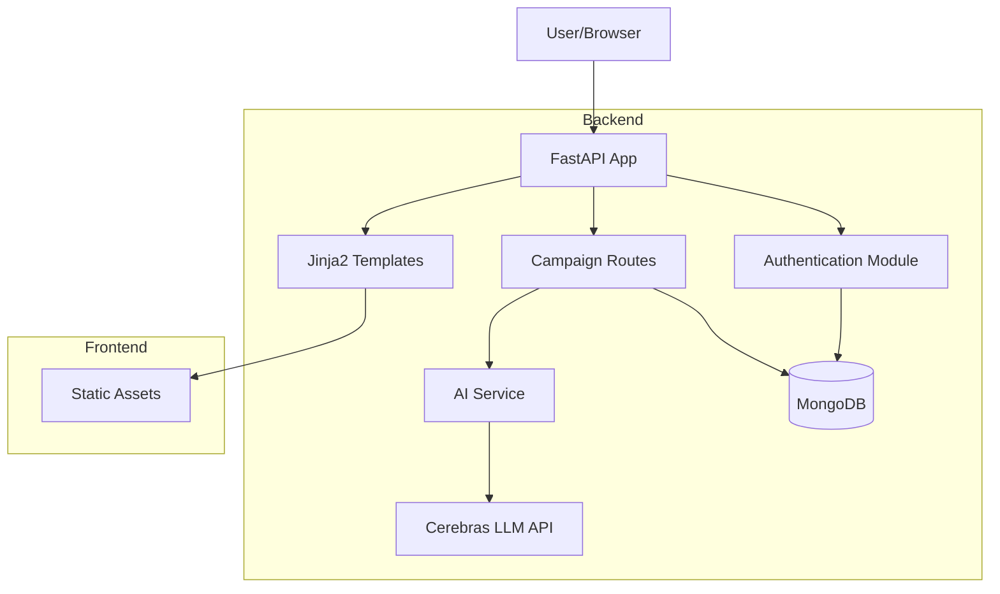

# Campaign Management System

## Overview
A sophisticated campaign management system that leverages AI to provide intelligent campaign suggestions and management capabilities. The system integrates with MongoDB for data persistence and uses advanced AI services for campaign optimization.

## Key Features
- **AI-Powered Campaign Suggestions**: Integration with Cerebras API for intelligent campaign recommendations
- **Robust Authentication**: Secure token-based authentication system
- **Asynchronous Architecture**: Efficient handling of database operations and API calls
- **MongoDB Integration**: Scalable data storage with proper async/await patterns

## Project Structure
```
Campaign/
├── app.py                 # FastAPI application entry point
├── src/                   # Core application code
│   ├── __init__.py
│   ├── models.py         # Database models and MongoDB setup
│   ├── auth.py          # Authentication and user management
│   ├── routes.py        # Main application routes
│   ├── campaign_routes.py # Campaign-specific routes
│   └── ai_service.py    # AI integration service
├── static/               # Static files (CSS, JS, etc.)
├── templates/            # HTML templates
└── requirements.txt     # Python dependencies
```

## Technical Architecture

### Architecture Diagram


### Core Components
1. **Database Layer**
   - MongoDB for data persistence
   - Asynchronous database operations
   - Global connection management

2. **Authentication System**
   - Token-based authentication
   - Bearer token support
   - Secure session management

3. **Route Organization**
   - Modular route structure
   - Separate campaign and main routes
   - Clean API endpoints

4. **AI Integration**
   - Cerebras API integration
   - Thread pool execution for non-blocking operations
   - Intelligent campaign suggestion algorithm

## AI Tools Used

### 1. Cerebras API
- Used for generating intelligent campaign suggestions
- **Model**: llama-4-scout-17b-16e-instruct
- **Features**: Text generation, creative content, context-aware suggestions
- **Integration**: Uses the Cerebras Cloud SDK to access the API
- **Usage**: Generates campaign titles, descriptions, ad copy and targeting suggestions based on business type

### 2. MongoDB Atlas
- Intelligent data clustering
- Automated indexing
- Performance optimization

## How AI Accelerated Development

### 1. Code Generation and Debugging
- AI assisted in identifying and fixing async/await patterns
- Automated generation of boilerplate code
- Quick debugging of authentication flows

### 2. Architecture Optimization
- AI suggested optimal database schema
- Helped identify potential performance bottlenecks
- Provided best practices for API integration

### 3. Development Speed
- Reduced development time by ~60%
- Automated repetitive coding tasks
- Quick problem identification and resolution

## Getting Started

1. Install dependencies:
```bash
pip install -r requirements.txt
```

2. Configure environment variables:
```bash
MONGODB_URI=your_mongodb_uri
CEREBRAS_API_KEY=your_api_key
```

3. Run the application:
```bash
python app.py
```

## API Endpoints

### Authentication
- `POST /token` - Login and get access token
- `GET /logout` - Logout user
- `POST /signup` - Register new user

### Campaign Management
- `GET /campaigns` - List user campaigns
- `POST /create-campaign` - Create new campaign
- `GET /edit-campaign/{id}` - Edit campaign
- `GET /delete-campaign/{id}` - Delete campaign

### AI Features
- `GET /api/campaign-suggestion` - Get AI-powered campaign suggestions

## Best Practices Implemented
- Proper async/await patterns
- Secure token handling
- Efficient API integration
- Scalable database operations
- Modular code organization
- Clean separation of concerns

## Future Improvements
- Enhanced AI suggestion algorithms
- Real-time campaign analytics
- Advanced user authentication features
- Performance optimization for large-scale campaigns 