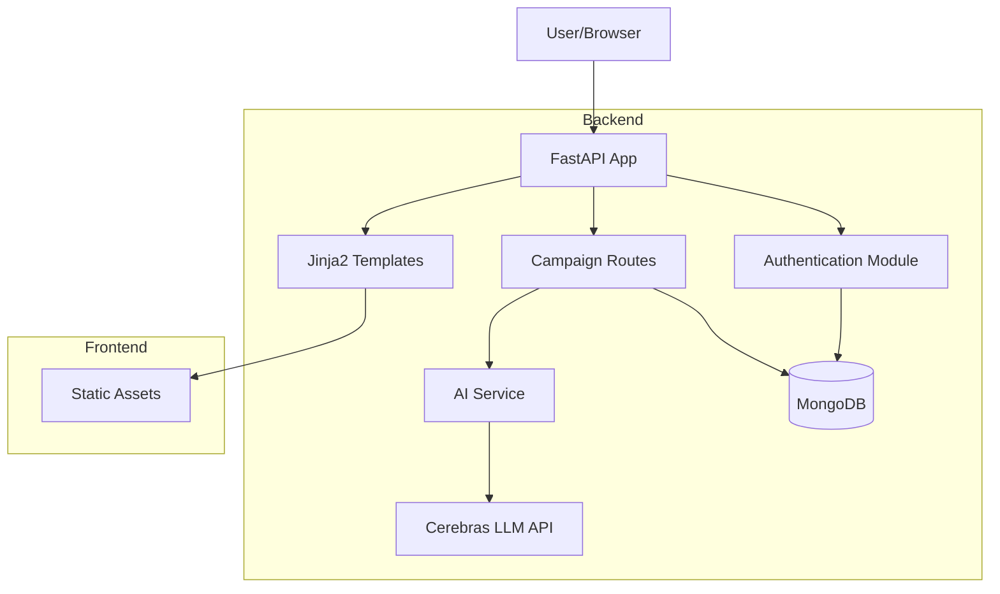

# Campaign Management System

## Overview
A sophisticated campaign management system that leverages AI to provide intelligent campaign suggestions and management capabilities. The system integrates with MongoDB for data persistence and uses advanced AI services for campaign optimization.

## Key Features
- **AI-Powered Campaign Suggestions**: Integration with Cerebras API for intelligent campaign recommendations
- **Robust Authentication**: Secure token-based authentication system
- **Ad Banner Upload**: Supports both URL and file upload options
- **Audience Targeting**: Age range, locations, and interests selection
- **Campaign Management**: Create and view campaigns with all details
- **AI-Powered Features**: Ad copy suggestions generated dynamically
- **Simulated Analytics**: Fake impressions, CTR, and spend data
- **Responsive Design**: Works on desktop and mobile devices
- **Campaign Status Control**: Activate, deactivate, and delete campaigns
- **Image Management**: GridFS storage for banner images
- **User Registration & Login**: Complete authentication flow
- **Campaign Editing**: Modify existing campaigns
- **Asynchronous Architecture**: Efficient handling of database operations and API calls
- **MongoDB Integration**: Scalable data storage with proper async/await patterns


🔗 Live Demo: https://mvp-of-advertising-dashboard.onrender.com

## Development Tools Used

### Claude (Anthropic's AI)
Claude was instrumental in designing and structuring the project:
- **Project Architecture**: Designed the initial project structure and file organization
- **Code Organization**: Suggested the modular approach with separate routes and services
- **Best Practices**: Provided guidance on FastAPI and MongoDB async patterns
- **Documentation**: Helped create comprehensive documentation and README
- **Problem Solving**: Assisted in debugging and error resolution
- **Code Review**: Suggested improvements and optimizations for existing code

### Cursor IDE
Cursor enhanced the development process through:
- **Code Generation**: Rapid implementation of routes and features
- **Real-time Assistance**: Instant code suggestions and completions
- **Error Detection**: Early identification of potential issues
- **Refactoring**: Smart code reorganization and cleanup
- **Integration Help**: Assistance with MongoDB and FastAPI integration
- **Testing**: Help with writing and implementing tests

## Project Structure
```
Campaign/
├── app.py                 # FastAPI application entry point
├── src/                   # Core application code
│   ├── __init__.py
│   ├── models.py         # Database models and MongoDB setup
│   ├── auth.py          # Authentication and user management
│   ├── routes.py        # Main application routes
│   ├── campaign_routes.py # Campaign-specific routes
│   └── ai_service.py    # AI integration service
├── static/               # Static files (CSS, JS, etc.)
├── templates/            # HTML templates
└── requirements.txt     # Python dependencies
```

## Technical Architecture

### Architecture Diagram


### Core Components
1. **Database Layer**
   - MongoDB for data persistence
   - Asynchronous database operations
   - Global connection management

2. **Authentication System**
   - Token-based authentication
   - Bearer token support
   - Secure session management

3. **Route Organization**
   - Modular route structure
   - Separate campaign and main routes
   - Clean API endpoints

4. **AI Integration**
   - Cerebras API integration
   - Thread pool execution for non-blocking operations
   - Intelligent campaign suggestion algorithm

## Technical Details
- **Backend**: FastAPI with async support
- **Database**: MongoDB with async operations
- **Authentication**: Token-based with secure session management
- **AI Integration**: Cerebras API for campaign suggestions
  - Model: llama-4-scout-17b-16e-instruct
  - Features: Text generation, creative content
- **Frontend**: Jinja2 Templates with static assets, using HTML, CSS, and JavaScript

## Getting Started

### 1. Create and Activate Virtual Environment
```bash
# Create virtual environment
python -m venv venv

# Activate virtual environment (Windows)
venv\Scripts\activate

# Activate virtual environment (macOS/Linux)
source venv/bin/activate
```

### 2. Install Dependencies
```bash
pip install -r requirements.txt
```

### 3. Configure Environment Variables
```bash
MONGODB_URI=your_mongodb_uri
CEREBRAS_API_KEY=your_api_key
```

### 4. Run the Application
```bash
python app.py
```

## Best Practices Implemented
- Proper async/await patterns
- Secure token handling
- Efficient API integration
- Scalable database operations
- Modular code organization
- Clean separation of concerns

