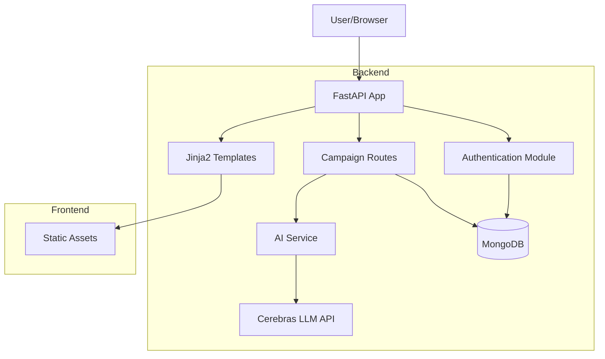

# Campaign Management System


## Overview
A sophisticated campaign management system that leverages AI to provide intelligent campaign suggestions and management capabilities. The system integrates with MongoDB for data persistence and uses advanced AI services for campaign optimization.

## Key Features
- **AI-Powered Campaign Suggestions**: Integration with Cerebras API for intelligent campaign recommendations
- **Robust Authentication**: Secure token-based authentication system
- **Asynchronous Architecture**: Efficient handling of database operations and API calls
- **MongoDB Integration**: Scalable data storage with proper async/await patterns


## Getting Started

### 1. Create and Activate Virtual Environment
```bash
# Create virtual environment
python -m venv venv

# Activate virtual environment (Windows)
venv\Scripts\activate

# Activate virtual environment (macOS/Linux)
source venv/bin/activate
```

### 2. Install Dependencies
```bash
pip install -r requirements.txt
```

### 3. Configure Environment Variables
```bash
MONGODB_URI=your_mongodb_uri
CEREBRAS_API_KEY=your_api_key
```

### 4. Run the Application
```bash
python app.py
```


## Project Structure
```
Campaign/
├── app.py                 # FastAPI application entry point
├── src/                   # Core application code
│   ├── __init__.py
│   ├── models.py         # Database models and MongoDB setup
│   ├── auth.py          # Authentication and user management
│   ├── routes.py        # Main application routes
│   ├── campaign_routes.py # Campaign-specific routes
│   └── ai_service.py    # AI integration service
├── static/               # Static files (CSS, JS, etc.)
├── templates/            # HTML templates
└── requirements.txt     # Python dependencies
```

## Technical Architecture

### Architecture Diagram


### Core Components
1. **Database Layer**
   - MongoDB for data persistence
   - Asynchronous database operations
   - Global connection management

2. **Authentication System**
   - Token-based authentication
   - Bearer token support
   - Secure session management

3. **Route Organization**
   - Modular route structure
   - Separate campaign and main routes
   - Clean API endpoints

4. **AI Integration**
   - Cerebras API integration
   - Thread pool execution for non-blocking operations
   - Intelligent campaign suggestion algorithm

## Technical Details
- **Backend**: FastAPI with async support
- **Database**: MongoDB with async operations
- **Authentication**: Token-based with secure session management
- **AI Integration**: Cerebras API for campaign suggestions
  - Model: llama-4-scout-17b-16e-instruct
  - Features: Text generation, creative content
- **Frontend**: Jinja2 Templates with static assets, using HTML, CSS, and JavaScript


## Best Practices Implemented
- Proper async/await patterns
- Secure token handling
- Efficient API integration
- Scalable database operations
- Modular code organization
- Clean separation of concerns

## Future Improvements
- Enhanced AI suggestion algorithms
- Real-time campaign analytics
- Advanced user authentication features
- Performance optimization for large-scale campaigns 