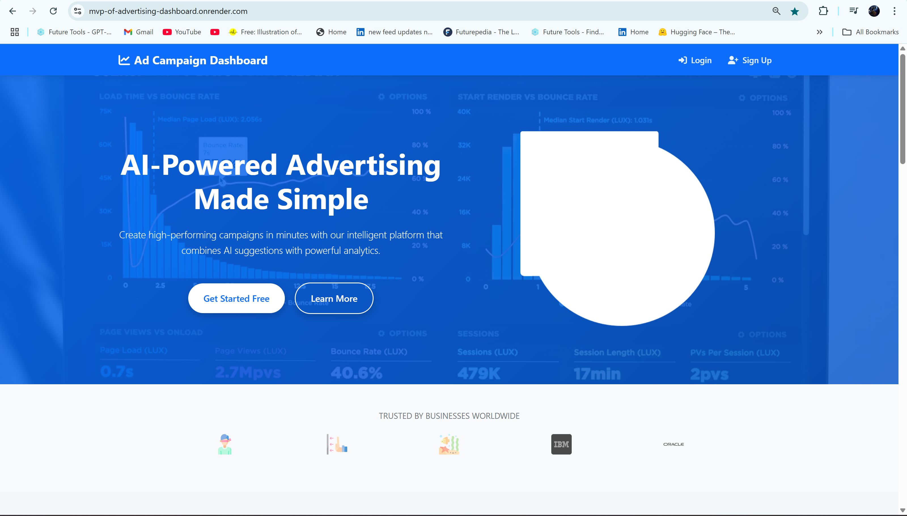
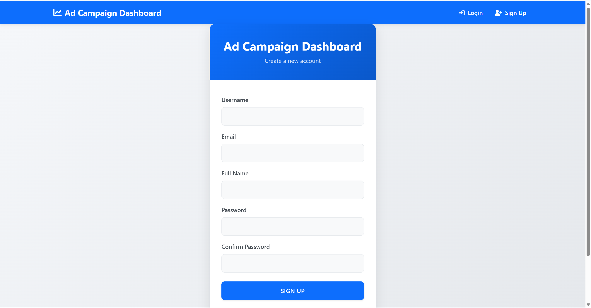
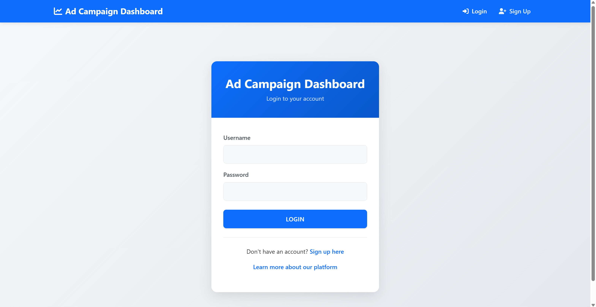
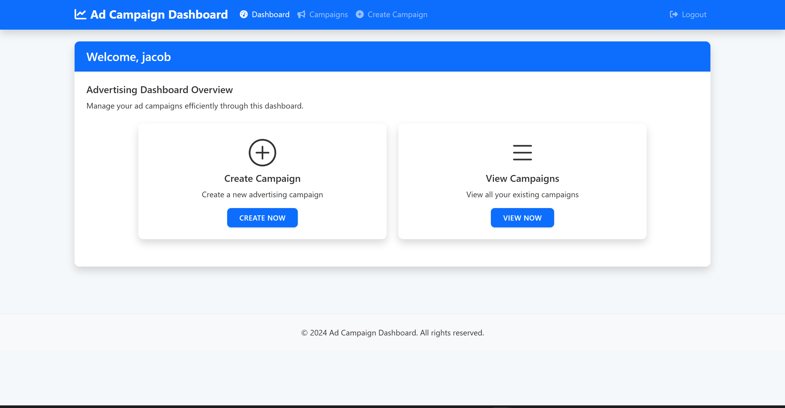
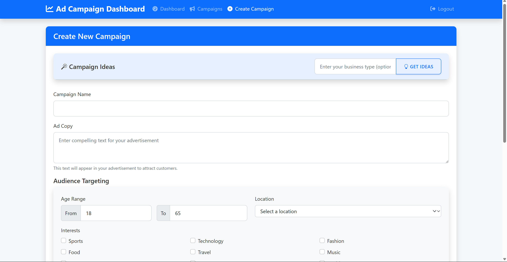
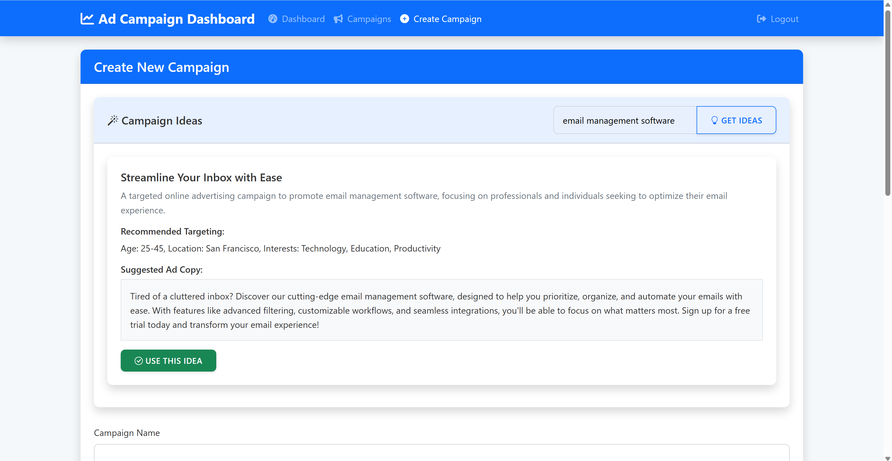
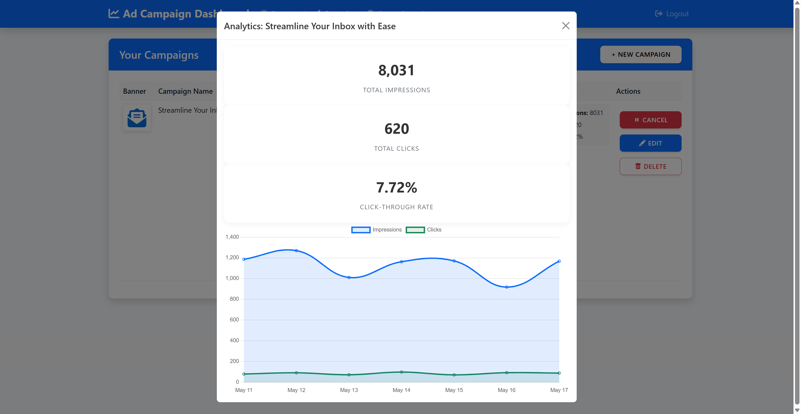

# Campaign Management System

## Overview
A sophisticated campaign management system that leverages AI to provide intelligent campaign suggestions and management capabilities. The system integrates with MongoDB for data persistence and uses advanced AI services for campaign optimization.

## Screenshots
<div align="center">
  
</div>

<details>
<summary>View More Screenshots</summary>
<div align="center">
  
  
  
  
  
  
  
</div>
</details>

## Key Features
- **User Authentication**: Secure token-based authentication with complete registration & login flow
- **Campaign Management**: Create, edit, activate, deactivate, and delete campaigns
- **Ad Content Management**: Banner upload via URL or file with GridFS storage
- **Audience Targeting**: Specify age ranges, locations, and interests
- **AI-Powered Capabilities**: Intelligent campaign suggestions and dynamic ad copy generation
- **Analytics Dashboard**: Simulated impressions, CTR, and spend data
- **Responsive Design**: Optimized for both desktop and mobile devices
- **Technical Foundation**: Asynchronous architecture with MongoDB integration


🔗 Live Demo: https://mvp-of-advertising-dashboard.onrender.com

## Development Tools Used

### Claude (Anthropic's AI)
Claude was instrumental in designing and structuring the project:
- **Project Architecture**: Designed the initial project structure and file organization
- **Code Organization**: Suggested the modular approach with separate routes and services
- **Best Practices**: Provided guidance on FastAPI and MongoDB async patterns
- **Documentation**: Helped create comprehensive documentation and README
- **Problem Solving**: Assisted in debugging and error resolution
- **Code Review**: Suggested improvements and optimizations for existing code

### Cursor IDE
Cursor enhanced the development process through:
- **Code Generation**: Rapid implementation of routes and features
- **Real-time Assistance**: Instant code suggestions and completions
- **Error Detection**: Early identification of potential issues
- **Refactoring**: Smart code reorganization and cleanup
- **Integration Help**: Assistance with MongoDB and FastAPI integration
- **Testing**: Help with writing and implementing tests

## Project Structure
```
Campaign/
├── app.py                 # FastAPI application entry point
├── src/                   # Core application code
│   ├── __init__.py
│   ├── models.py         # Database models and MongoDB setup
│   ├── auth.py          # Authentication and user management
│   ├── routes.py        # Main application routes
│   ├── campaign_routes.py # Campaign-specific routes
│   └── ai_service.py    # AI integration service
├── static/               # Static files (CSS, JS, etc.)
├── templates/            # HTML templates
└── requirements.txt     # Python dependencies
```

## Technical Architecture

### Architecture Diagram


### Core Components
1. **Database Layer**
   - MongoDB for data persistence
   - Asynchronous database operations
   - Global connection management

2. **Authentication System**
   - Token-based authentication
   - Bearer token support
   - Secure session management

3. **Route Organization**
   - Modular route structure
   - Separate campaign and main routes
   - Clean API endpoints

4. **AI Integration**
   - Cerebras API integration
   - Thread pool execution for non-blocking operations
   - Intelligent campaign suggestion algorithm

## Technical Details
- **Backend**: FastAPI with async support
- **Database**: MongoDB with async operations
- **Authentication**: Token-based with secure session management
- **AI Integration**: Cerebras API for campaign suggestions
  - Model: llama-4-scout-17b-16e-instruct
  - Features: Text generation, creative content
- **Frontend**: Jinja2 Templates with static assets, using HTML, CSS, and JavaScript

## Getting Started

### 1. Create and Activate Virtual Environment
```bash
# Create virtual environment
python -m venv venv

# Activate virtual environment (Windows)
venv\Scripts\activate

# Activate virtual environment (macOS/Linux)
source venv/bin/activate
```

### 2. Install Dependencies
```bash
pip install -r requirements.txt
```

### 3. Configure Environment Variables
```bash
MONGODB_URI=your_mongodb_uri
CEREBRAS_API_KEY=your_api_key
```

### 4. Run the Application
```bash
python app.py
```
## Best Practices
- **Code Organization**: Modular structure with separate routes and services
- **Security**: Secure token-based authentication and password hashing
- **Performance**: Asynchronous operations for database and API calls
- **Error Handling**: Comprehensive error handling and validation
- **Database**: Proper MongoDB integration with indexes
- **API Design**: RESTful endpoints with proper status codes
- **Frontend**: Responsive design with modern UI/UX

## License
This project is licensed under the MIT License
